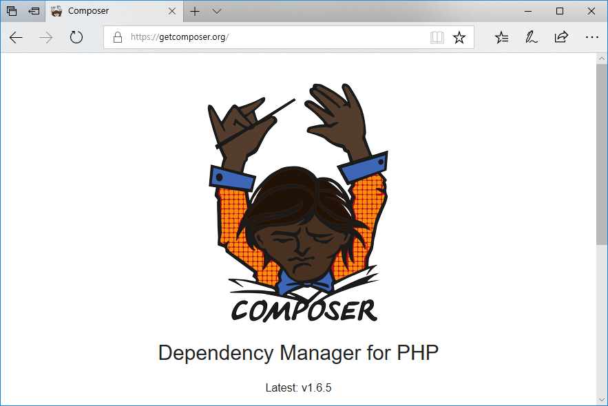
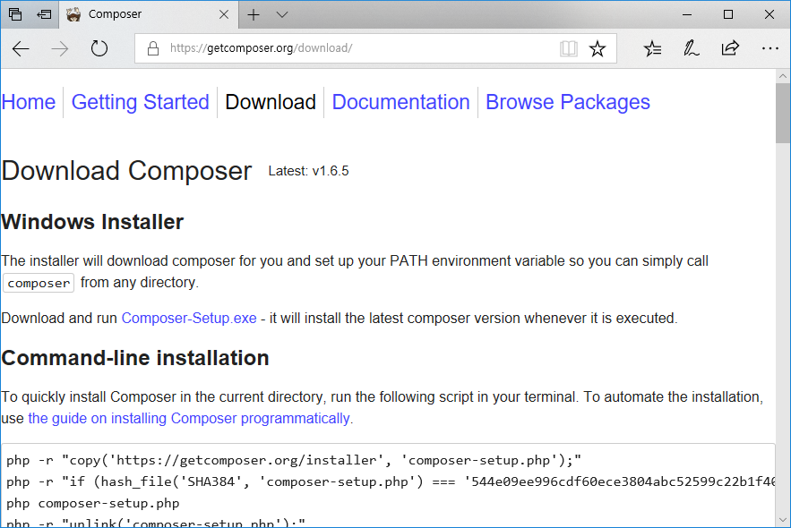
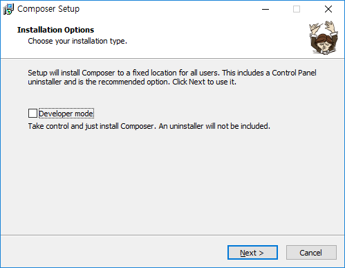
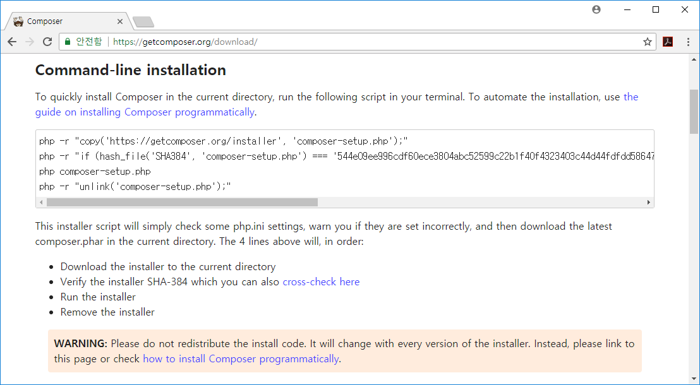
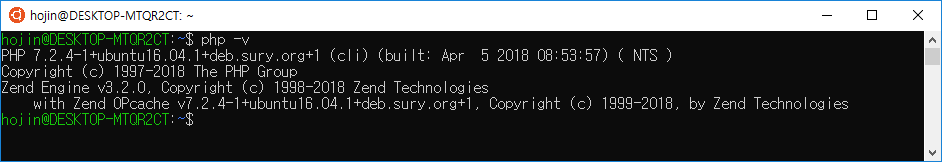
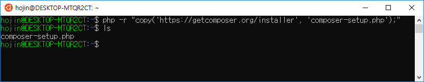
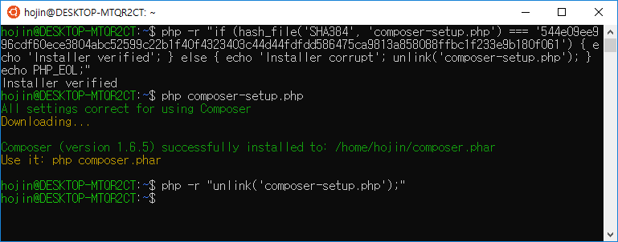
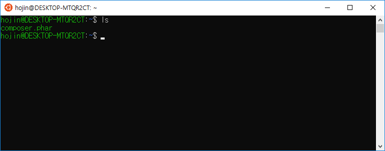
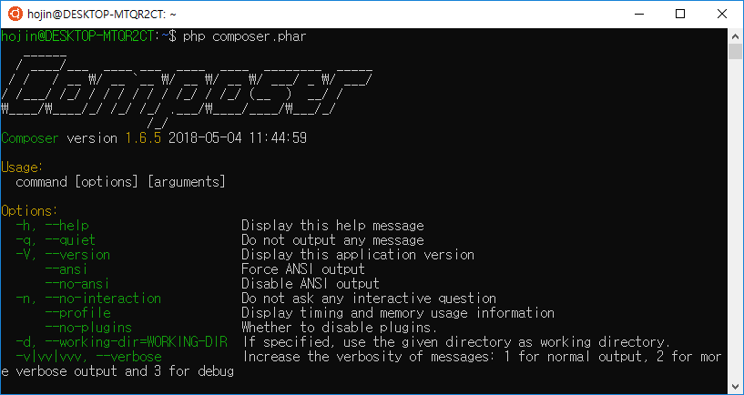

# 02. 설치
---
PHP언어는 더 이상 리눅스만의 전용 웹 서버사이드 언어가 아닙니다. 윈도우, 맥(Mac)등 다양한 운영체제를 지원하고 있습니다.  

따라서 PHP 라이브러리 패키지 관리 도구인 컴포저 한 양한 운영체제에서 설치하여 사용을 할 수 있습니다.  

<br>
## 02.1 공식사이트
---
컴포저의 공식 사이트는 getcomposer.org 입니다. 이곳에서 리눅스, 맥 운영체제에 대한 설치방법과 윈도우 전용 설치파일을 다운로드 받을 수 있습니다.  



공식 웹사이트를 조금만 밑으로 내려보면 소개와 다운로드 및 몇 개의 클릭할 수 있는 버튼을 보실 수 있습니다. 이곳에서 다운로드를 선택합니다.  

다운로드 페이지는 여러 운영체제에 대해서 설치할 수 있는 방법들이 자세히 설명되어 지고 있습니다.  

<br>
## 02.2 윈도우 설치
---
윈도우에서는 별도의 설치파일을 이용하여 좀더 쉽게 설치를 할 수 있습니다.  
아래 화면은 “다운로드”를 선택했을 경우 나오는 페이지 입니다.


 

친절하게도 “Composer-Setup.exe”파일을 다운로드 하라고 안내와 연결 링크를 제공합니다.  
실행파일을 다운로드 받아 클릭하시면 됩니다.

당연한 이야기 이겠지만, 컴포저를 설치하기 전에 미리 PHP가 설치되어 있어야 합니다.  
컴포저는 설치하는 과정에서 시스템에 설치된 PHP 경로를 자동으로 검색을 합니다.  
만일, 설치경로를 실패하였거나 다른 PHP버전의 설치경로를 수동으로 입력을 할 수도 있습니다.

컴포저 설치는 몇 개의 단계를 통하여 진행하게 됩니다.  



다음(Next)을 선택합니다.  

<br>
## 02.3 리눅스/맥 설치
---
리눅스와 맥 운영체제의 설치 방법은 유사합니다. 다운로드 페이지에 보면 윈도우와 맥에서도 설치하는 방법이 자세히 나와 있습니다.

리눅스와 맥에서 컴포저를 설치하기 위해서는 터미널 모드에서 설치 명령을 입력해야 합니다.



터미널 창을 실행후에 지시한 명령을 입력하면 됩니다.

컴포저 설치를 위해서는 먼저 PHP가 설치가 되어 있어야 합니다.

```php
$ php -v
```

명령을 입력하여 PHP가 정상적으로 설치가 되어 있는지 미리 확인을 하도록 합니다.




#### 단계1
```php
php -r "copy('https://getcomposer.org/installer', 'composer-setup.php');"

첫번째 명령을 실행하게 되면 컴포저 서버로부터 composer-setup.php를 다운로드하게 됩니다.
hojin@DESKTOP-MTQR2CT:~$ php -r "copy('https://getcomposer.org/installer', 'composer-setup.php');"
hojin@DESKTOP-MTQR2CT:~$ ls
composer-setup.php
```
 

#### 단계2
```php
php -r "if (hash_file('SHA384', 'composer-setup.php') === '544e09ee996cdf60ece3804abc52599c22b1f40f4323403c44d44fdfdd586475ca9813a858088ffbc1f233e9b180f061') { echo 'Installer verified'; } else { echo 'Installer corrupt'; unlink('composer-setup.php'); } echo PHP_EOL;"
```

보안을 위해서 설치관련 토큰값이 같이 입력됩니다. 위의 예제코드를 따라하시지 말고, 사이트에 접속하여 설치 코드를 복사하여 입력을 하도록 합니다.



설치가 완료가 되면 현재 폴더에 composer.phar 파일이 생성된 것을 확인할 수 있습니다.
```php
hojin@DESKTOP-MTQR2CT:~$ ls
composer.phar
```




composer.phar은 composer 실행파일 입니다.

#### 단계3
php composer-setup.php

#### 단계4
php -r "unlink('composer-setup.php');"

이제 맥/Linux 상에서 컴포저를 설치를 하였습니다. 그럼 컴포저를 실행해 보도록 합니다. 터미널에서 php composer.phar 를 입력합니다. 아래와 같이 컴포저의 실행화면을 확인할 수 있습니다.



위와 같이 PHP를 이용하여 같이 실행을 하는 것 외에 composer 명령만으로도 실행을 할 수 있습니다. 이는 맥/Linux 상에 bin 디렉토리에 같이 설치가 되기 때문입니다.

정상적으로 설치가 완료가 되었다면 /usr/bin 폴더안에 컴포저가 설치가 된 것을 확인할 수 있습니다.

설치가 정상적으로 되었다면 실행을 해봅니다. 명령창에서 직접 composer를 입력해 봅니다.

 

정상적으로 composer 명령만 가지고도 실행이 되는 것을 확인할 수 있습니다.

<br>
## 02.4 CURL
---
자신의 시스템의 경우 curl이 설치가 되어 있다면 curl을 통하여 설치를 할 수도 있습니다.

```php
$ curl -s https://getcomposer.org/installer | php
```

리눅스나 맥과 같은 운영체제의 경우 curl은 기본적으로 설치되는 경우가 많이 있습니다.

<br>
## 02.5 명령어
---
컴포저는 CLI 형태로 다양한 명령어를 통하여 의존성 관리 작업을 할 수 있습니다.  
터미널 창에서 composer 명령만 입력을 하면 관련 옵션들을 확인할 수 있습니다.

<br>
### 11.4.1 사용방법
---
Composer 다음에 실행 명령 또는 옵션을 같이 작성하여 입력하면 됩니다.

```php
Composer command [options] [arguments]
```

예를들어 컴포저의 버전을 확인하고 싶을 경우 다음과 같이 입력합니다.

```php
C:\Users\infoh>composer -V
Composer version 1.6.5 2018-05-04 11:44:59
```
<br>
### 11.4.2 옵션
---
컴포저는 다음과 같이 몇 개의 옵션들을 가지고 있습니다.


#### -h, --help
Display this help message

#### -q, --quiet                    
Do not output any message

#### -V, --version                  
Display this application version

#### --ansi, --no-ansi                  
Force ANSI output. Disable ANSI output

-n, --no-interaction           Do not ask any interactive question
      --profile                  Display timing and memory usage information
      --no-plugins               Whether to disable plugins.
-d, --working-dir=WORKING-DIR
If specified, use the given directory as working directory.

#### -v|vv|vvv, --verbose
Increase the verbosity of messages: 1 for normal output, 2 for more verbose output and 3 for debug

<br>
### 11.4.3 명령어
---
컴포저는 다음과 같이 몇 개의 명령어들을 가지고 있습니다.

#### about
Shows the short information about Composer.

#### archive
Creates an archive of this composer package.

#### browse
Opens the package's repository URL or homepage in your browser.

#### check-platform-reqs
Check that platform requirements are satisfied.

#### clear-cache
Clears composer's internal package cache.

#### clearcache
Clears composer's internal package cache.

#### config
Sets config options.

#### create-project
Creates new project from a package into given directory.

#### depends
Shows which packages cause the given package to be installed.

#### diagnose
Diagnoses the system to identify common errors.

#### dump-autoload
Dumps the autoloader.

#### dumpautoload
Dumps the autoloader.

#### exec
Executes a vendored binary/script.

#### global
Allows running commands in the global composer dir ($COMPOSER_HOME).

#### help
Displays help for a command

#### home
Opens the package's repository URL or homepage in your browser.

#### info
Shows information about packages.

#### init
Creates a basic composer.json file in current directory.

#### install
Installs the project dependencies from the composer.lock file if present, or falls back on the composer.json.

#### licenses
Shows information about licenses of dependencies.

#### list
Lists commands

#### outdated
Shows a list of installed packages that have updates available, including their latest version.

#### prohibits
Shows which packages prevent the given package from being installed.

#### remove
Removes a package from the require or require-dev.

#### require
Adds required packages to your composer.json and installs them.

#### run-script
Runs the scripts defined in composer.json.

#### search
컴포저 터미널 모드에서 페키지를 검색합니다.

#### self-update
Updates composer.phar to the latest version.
 
#### selfupdate
Updates composer.phar to the latest version.

#### show
Shows information about packages.

#### status
Shows a list of locally modified packages, for packages installed from source.

#### suggests
Shows package suggestions.

#### update
Upgrades your dependencies to the latest version according to composer.json, and updates the composer.lock file.

#### Upgrade
Upgrades your dependencies to the latest version according to composer.json, and updates the composer.lock file.

#### validate
Validates a composer.json and composer.lock.

#### why
Shows which packages cause the given package to be installed.

#### why-not
Shows which packages prevent the given package from being installed.

<br>
<br>
<br>
<br>