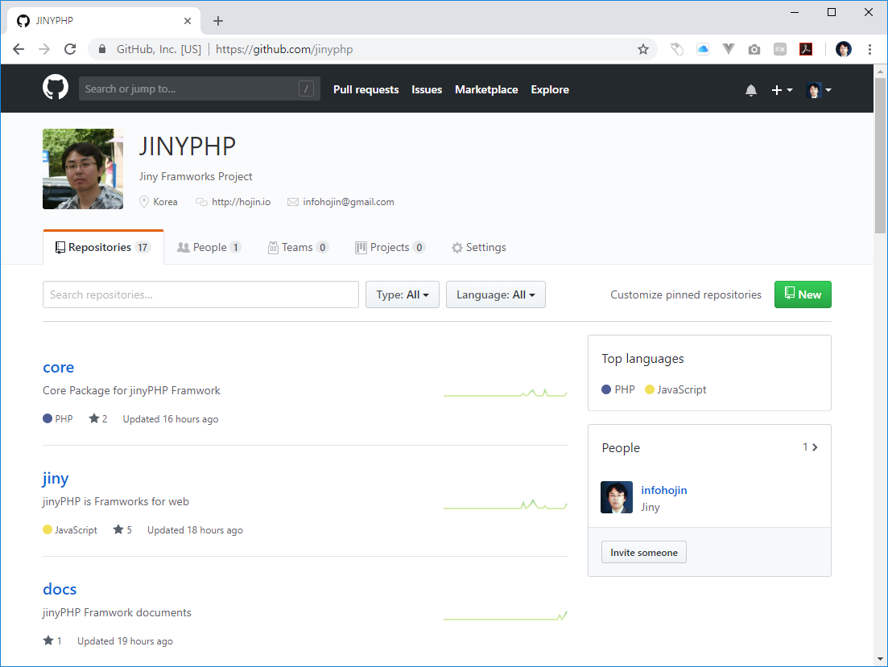
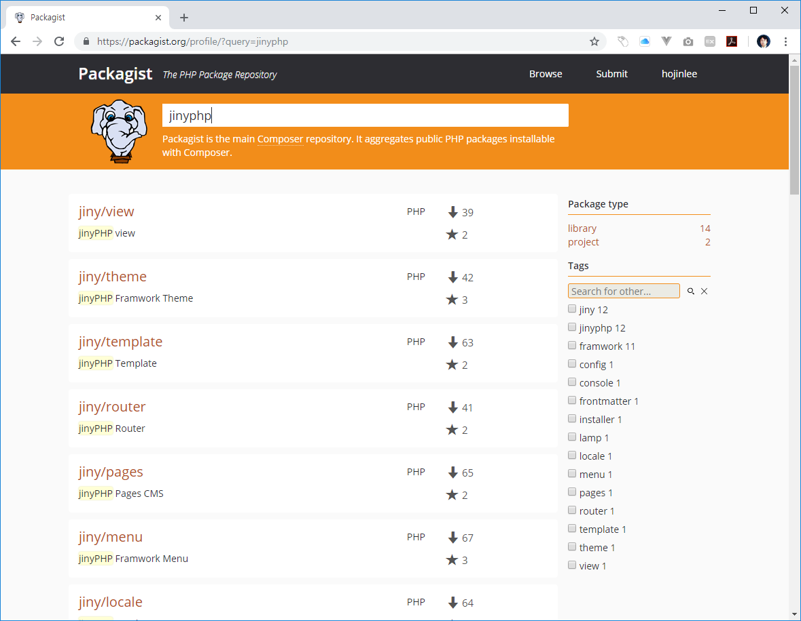

# 소스코드
---
`지니PHP`는 오픈소스 프로젝트 입니다.  
지니PHP는 PHP 웹프레임워크로 MVC 패턴으로 구성되어 있습니다. 또한, 여러개의 저장소로 기능별 분리되어 있습니다.  

PHP는 github에 등록된 개발언어 337개중 Top 5안에 들어가는 인기 언어입니다.  

 
## 깃허브
---
모든 소스는 깃허브에 공개되어 있습니다.  
저장소의 주소는 `https://github.com/jinyphp` 로 접속하시면 됩니다.  

깃허브의 저장소는 여러개의 저장소로 구성됩니다. 각각의 구성마다 개별 기능입니다.  
각 기능별로 프로젝트를 참여할 수 있습니다.

 
### 개발 참여
---
지니PHP는 모든 사람들에게 공개되어 있습니다. 또한, 코드 개발참여를 하실 수 있습니다.  
언제나 우리는 같이 프로젝트를 성장시킬 커미터를 찾고 있습니다. 많은 관심과 성원 부탁드립니다.  

 
## 페키지스트
---
각각의 깃허브 저장소는 패키지로 제작되어 배포됩니다.  
PHP로 작성된 `깃`저장소는 Packagist에 등록되어 있습니다. 이는 각각의 PHP 라이브러리 입니다.  

패키지는 `composer`를 통하여 설치할 수 있습니다.

 
 
 
 